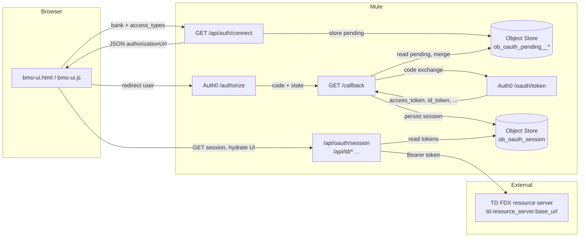
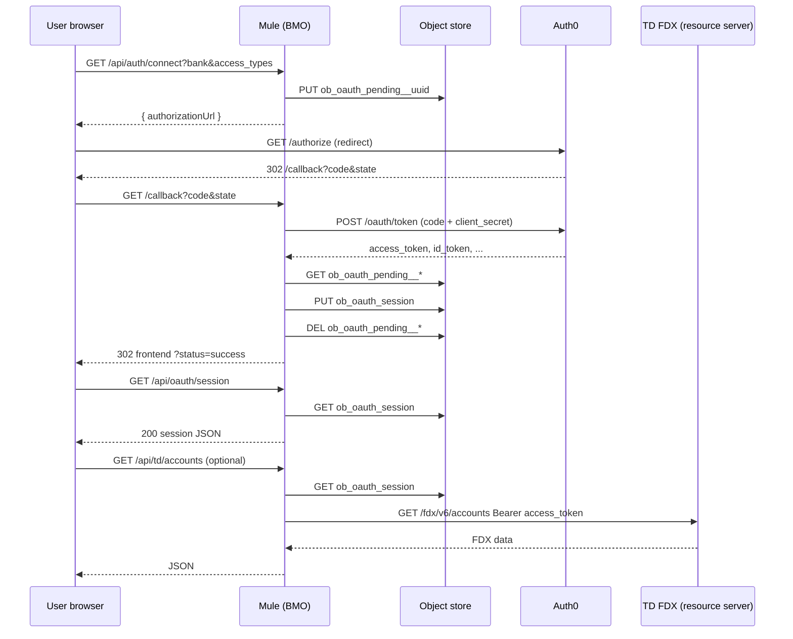

# OAuth in `ob_client_bmo` — architecture and data flow

This document describes how **OAuth 2.0** is wired in the BMO Open Banking client (Mule app), including the **handshake**, **token/session storage**, **expiry behavior**, the **connected account** model, the **OAuth provider (authorization server)**, the **resource server** usage, and end-to-end **data flow**.

> **Related:** `docs/OAUTH_SECURITY_GUIDE.md` focuses on security posture; this document focuses on **runtime behavior and components**.

---

## 1. Roles and terminology


| Role                                        | In this project                                                                                                                                                                                                                                                                                             |
| ------------------------------------------- | ----------------------------------------------------------------------------------------------------------------------------------------------------------------------------------------------------------------------------------------------------------------------------------------------------------- |
| **User / browser**                          | Initiates “Connect bank”, follows redirects, stores UI state (e.g. `localStorage`).                                                                                                                                                                                                                         |
| **BMO Mule app (OAuth client)**             | Exposes `/api/auth/connect` and `/callback`, exchanges the authorization `code` for tokens, and stores the session. Implemented in `src/main/mule/oauth-flow.xml`.                                                                                                                                          |
| **Authorization server (OAuth “provider”)** | **Auth0** — issue authorization pages and tokens. Endpoints and credentials come from `local.yaml` / properties: `oauth.auth0.`* (`authorize_endpoint`, `token_endpoint`, `client_id`, `client_secret`, `redirect_uri`, `audience`).                                                                        |
| **Resource server**                         | The **FDX API** that holds bank data. In deployed flows, the TD implementation is called at a configurable base URL: `td.resource_server.base_url` in `application.properties` (see `td-proxy-flow.xml`). The access token (from Auth0) is presented as `Authorization: Bearer <access_token>` to that API. |
| **Object Store**                            | Mule **persistent** store `oauth_object_store` (`global.xml`) — holds **pending consent** and the **active OAuth session** document.                                                                                                                                                                        |


**FDX alignment:** Requested access is expressed as FDX-style scope names (`ACCOUNT_BASIC`, `TRANSACTIONS`, `CUSTOMER_CONTACT`), validated on connect and merged into the session after token exchange.

---

## 2. High-level data flow




---

## 3. OAuth handshake (authorization code flow)

### 3.1 Step A — Initiate: `GET /api/auth/connect`

- **File:** `oauth-flow.xml` — flow `oauth-connect-flow`
- **Query parameters (required):**
  - `bank` — bank name / selection (used for branding and display).
  - `access_types` — comma-separated FDX scope codes, e.g. `ACCOUNT_BASIC,TRANSACTIONS`.
- **Validation:** Both parameters required; scope list validated against `ACCOUNT_BASIC`, `TRANSACTIONS`, `CUSTOMER_CONTACT`.
- **State & pending record:**
  - A composite `**state`** string is built: `bank + "__OB__" + access_types + "__OB__" + <uuid>`.
  - A **pending consent** document is written to the object store at key:  
  `ob_oauth_pending__<uuid>` (uuid is the last segment of `state`).
  - Pending payload includes human-readable scope labels, bank display fields, and `createdAt` timestamp.
- **Response:** JSON (not a redirect) including:
  - `authorizationUrl` — Auth0 authorization endpoint with:
    - `response_type=code`
    - `client_id`, `redirect_uri`, `audience`, `scope` (OpenID + FDX-related scopes)
    - `state` = composite string above
  - The **UI** (`bmo-ui.js`) typically navigates the browser to `authorizationUrl` (full page redirect to Auth0).

### 3.2 Step B — User at Auth0

- The user signs in and consents at **Auth0** (authorization server). Auth0 is not the bank; it issues tokens intended for the configured **audience** (e.g. `urn:fdx:tdbank` in `local.yaml`).

### 3.3 Step C — Callback: `GET /callback`

- **File:** `oauth-flow.xml` — flow `oauth-callback-flow`
- **Query parameters:** `code` (required), `state` (echoed from step A).
- If `code` is missing → **302** redirect to `frontend.base_url` + `frontend.error_redirect_path` + `&error=missing_code`.
- Otherwise:
  1. **Token request** — `POST` to `${oauth.auth0.token_endpoint}` with `application/x-www-form-urlencoded` body:
    - `grant_type=authorization_code`
    - `client_id`, `client_secret`, `code`, `redirect_uri` (must match the registered callback).
  2. On **success (2xx):**
    - **Retrieve pending consent** from object store: key derived from `state` by splitting on `__OB__` and using `ob_oauth_pending__<lastPart>`.
    - **Merge** Auth0 response with pending metadata and Auth0-issued `scope` into a single **session document** (see §4).
    - **Persist** session under fixed key: `**ob_oauth_session`**.
    - **Delete** the pending key (best effort).
    - **302** redirect the browser to:  
    `${frontend.base_url}/?status=success&bank=<encoded>&scopes=<encoded>` (bank and granted scope context for the UI).
  3. On **token error:** redirect to frontend error path with `error=token_exchange_failed` (or similar).
  4. Unhandled errors → `error=internal_error`.

**Note:** This is a **server-side** confidential client (uses `client_secret` on token endpoint). A **PKCE** flow is *not* what the Mule `oauth-flow.xml` implements for token exchange; the security guide’s PKCE note may reflect a target pattern—follow the code for exact behavior.

---

## 4. Token storage and session document

### 4.1 Object store keys


| Key pattern                | Purpose                                                                                                 |
| -------------------------- | ------------------------------------------------------------------------------------------------------- |
| `ob_oauth_pending__<uuid>` | Short-lived; consent metadata for the in-flight Auth0 round-trip. Removed after successful callback.    |
| `ob_oauth_session`         | **Single** active session for the app instance — the “connected account” from the server’s perspective. |


### 4.2 What is stored in `ob_oauth_session`

Populated in `Prepare Token Storage` in `oauth-callback-flow`. Representative fields (see `oauth-flow.xml` for the canonical list):

- **Tokens from Auth0:** `access_token`, `id_token`, `token_type`, `expires_in`, and computed `**expires_at`**, `stored_at`.
- **Session id:** `session_id` (application-generated id string).
- **Bank / product context (from pending + state):** `bankName`, `bankDisplayName`, `bankBrand`, `externalBankId`, `requested_scopes`, `scopes_technical`, `scopes_human`, `oauth_grant_scope` (string from provider), `consent_created_at`.

**Persistence:** The entire session object is stored in `**oauth_object_store`** (persistent). Survives Mule app restart until cleared or replaced.

### 4.3 Token refresh

**Current implementation:** The sub-flow `get-oauth-tokens-subflow` **loads** `ob_oauth_session` and compares `**now()`** to `**expires_at**`. If expired, it returns a JSON error:

```json
{ "error": "token_expired", "error_description": "OAuth tokens have expired. Please re-authenticate." }
```

There is **no** `grant_type=refresh_token` call to Auth0 in this repository’s Mule flows. If Auth0 returns a `refresh_token`, it is **not** wired into an automatic refresh pipeline in the examined XML.

**User-visible implication:** When access expires, the user must **go through “Connect” again** (new authorization) unless a refresh path is added later.

---

## 5. Connected account (from the UI’s perspective)

1. **After redirect success** — The SPA loads; scripts call `**GET /api/oauth/session`** (flow `oauth-session-http-flow` → `oauth-session-api-subflow`).
2. **If session exists** — Response **200** with token metadata and bank/scope fields (sensitive: full `access_token` is returned; treat as **highly sensitive** in production — see security guide).
3. **UI persistence** — `bmo-ui.js` syncs into `**localStorage`**-backed connection objects for UX (e.g. which bank, labels, “connected” hub state). The **authoritative** server state remains the object store entry.
4. **Disconnect** — `**POST /api/oauth/disconnect`** removes `ob_oauth_session` (idempotent if already missing). The UI should clear local state after success.

**Single session model:** The design uses one global key `ob_oauth_session` per app instance — not multi-user on the same node without additional partitioning.

---

## 6. Resource server: using the access token to call the bank API

**TD FDX proxy (`td-proxy-flow.xml`):**

- Inbound: e.g. `GET /api/td/accounts` (and related paths) on the BMO HTTP listener.
- The flow **loads** `ob_oauth_session`, extracts `access_token`, and forwards the request to:
  - `GET {td.resource_server.base_url}/fdx/v6/...`
- **Header:** `Authorization: Bearer <access_token>`

So **BMO** acts as a **backend-for-frontend / API gateway**: the browser is not required to hold the access token for TD calls if the UI calls only BMO; the token stays server-side in the object store for those proxy flows.

**Other FDX / mock routes:** `ui-flow.xml` and `fdx-core-router.xml` may use OAuth context differently (e.g. mock or core router); the TD path above is the clearest “resource server” integration in code.

---

## 7. API summary


| Method | Path                                  | Role                                                                |
| ------ | ------------------------------------- | ------------------------------------------------------------------- |
| GET    | `/api/auth/connect`                   | Build Auth0 URL + store pending; returns JSON.                      |
| GET    | `/callback`                           | Auth0 redirect target; code exchange; save session; redirect to UI. |
| GET    | `/api/oauth/session`                  | Expose current session to UI (or 404 if none).                      |
| POST   | `/api/oauth/disconnect`               | Clear `ob_oauth_session`.                                           |
| GET    | `/api/td/`* (see `td-proxy-flow.xml`) | Proxy to TD FDX with Bearer token.                                  |


**Configuration:** `APP_BASE_URL`, `oauth.`*, `frontend.*`, `td.resource_server.base_url` in `application.properties` and `local.yaml`.

---

## 8. End-to-end sequence (concise)




---

## 9. Files to read in the repo


| Area                              | File(s)                                                                      |
| --------------------------------- | ---------------------------------------------------------------------------- |
| Connect + callback + session APIs | `src/main/mule/oauth-flow.xml`                                               |
| Object store / module             | `src/main/mule/global.xml`                                                   |
| TD resource server proxy          | `src/main/mule/td-proxy-flow.xml`                                            |
| OAuth config                      | `src/main/resources/local.yaml`, `src/main/resources/application.properties` |
| UI connect + session + disconnect | `src/main/resources/web/bmo-ui.js`                                           |
| Deeper security write-up          | `docs/OAUTH_SECURITY_GUIDE.md`                                               |


---

*Generated from the `ob_client_bmo` codebase structure and flow definitions. If you add refresh-token support or change session keys, update this document in the same PR.*