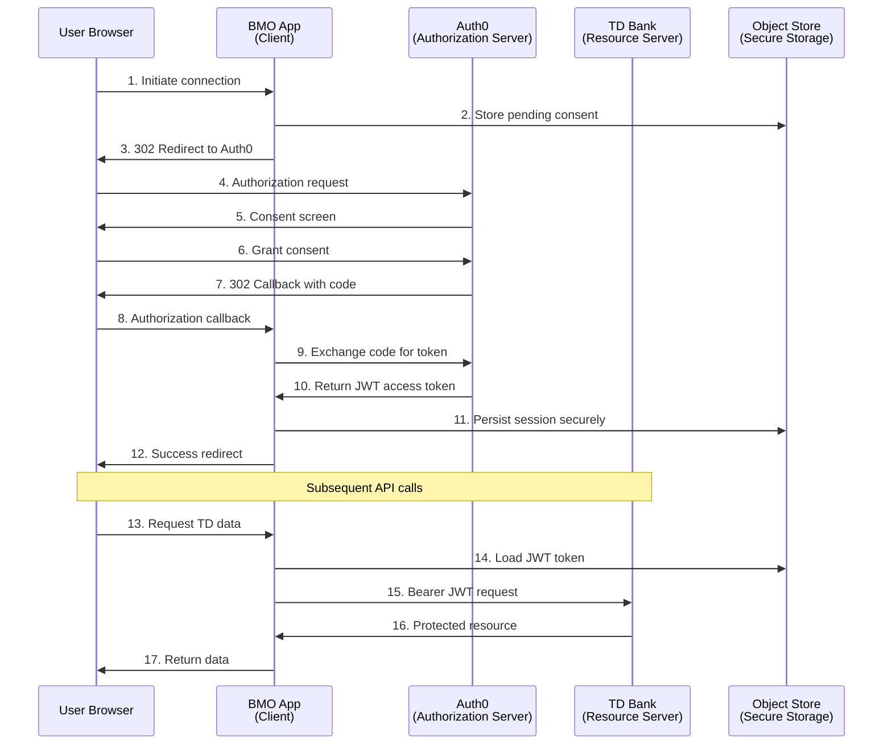

# BMO Open Banking - OAuth 2.0 Security Guide

> **Comprehensive security documentation for OAuth 2.0 implementation in the BMO Open Banking client**

## 🔐 Overview

The BMO Open Banking application implements **OAuth 2.0 Authorization Code flow** with **PKCE (Proof Key for Code Exchange)** extensions to securely connect to external financial institutions. This guide details the security architecture, implementation patterns, and best practices.

## 🏗️ Security Architecture

### Authentication Flow Overview



## 🔑 Token Management

### JWT Token Structure

**Header:**
```json
{
  "alg": "RS256",
  "typ": "JWT",
  "kid": "auth0-key-id"
}
```

**Payload:**
```json
{
  "iss": "https://dev-77sisti8b11ec8tp.us.auth0.com/",
  "sub": "auth0|user-id",
  "aud": ["urn:fdx:tdbank", "https://dev-77sisti8b11ec8tp.us.auth0.com/userinfo"],
  "azp": "ywXBlXbbDmE8K2VkuXKy36YjjHlo7iTv",
  "scope": "openid profile email ACCOUNT_BASIC TRANSACTIONS",
  "iat": 1713196568,
  "exp": 1713282968
}
```

**Key Claims:**
- `iss` - Auth0 tenant issuer
- `aud` - Target audience (TD Bank identifier)
- `scope` - Granted FDX permissions
- `exp` - Token expiration timestamp
- `sub` - User identifier

### Secure Token Storage

**Object Store Configuration:**
```xml
<os:object-store name="oauth_object_store" 
                 doc:name="OAuth persistent store" 
                 persistent="true" 
                 maxEntries="1000"
                 entryTtl="86400"
                 expirationInterval="3600" />
```

**Storage Pattern:**
- **Key:** `ob_oauth_session` (single session per app instance)
- **Value:** Encrypted session object containing JWT + metadata
- **TTL:** 24 hours (matches token lifetime)

**Session Object Structure:**
```json
{
  "accessToken": "eyJ0eXAiOiJKV1QiLCJhbGciOiJSUzI1NiIs...",
  "tokenType": "Bearer",
  "expiresIn": 86400,
  "expiresAt": "2026-04-16T13:36:08Z",
  "scopes": ["ACCOUNT_BASIC", "TRANSACTIONS"],
  "bank": {
    "name": "TD",
    "displayName": "TD Canada Trust",
    "brand": "#00B04F"
  },
  "connectedAt": "2026-04-15T13:36:08Z",
  "correlationId": "bmooauth-abc123-def456"
}
```

## 🛡️ Security Controls

### 1. Authorization Request Security

**State Parameter Composition:**
```
{bank}__OB__{scopes_csv}__OB__{uuid}
```

Example: `TD__OB__ACCOUNT_BASIC,TRANSACTIONS__OB__a1b2c3d4-e5f6-7890-abcd-ef1234567890`

**Components:**
- **Bank identifier** - Fallback bank name
- **Scope list** - Requested FDX permissions  
- **UUID** - Unique identifier for pending consent record

**CSRF Protection:**
1. Generate cryptographically secure UUID
2. Store pending consent with UUID as key
3. Include UUID in state parameter
4. Validate state on callback
5. Remove pending consent after successful exchange

### 2. Scope Validation

**FDX Scope Definitions:**
```yaml
VALID_FDX_SCOPES:
  ACCOUNT_BASIC: "Access to account information and balances"
  TRANSACTIONS: "Access to account transaction history"
  CUSTOMER_CONTACT: "Access to customer contact information"
  ACCOUNT_DETAILED: "Access to detailed account information"
  INVESTMENTS: "Access to investment account information"
```

**Validation Logic:**
```dataweave
%dw 2.0
output application/java
var requestedScopes = (attributes.queryParams.access_types default "") splitBy ","
var validScopes = ["ACCOUNT_BASIC", "TRANSACTIONS", "CUSTOMER_CONTACT"]
---
requestedScopes filter (scope) -> validScopes contains scope
```

### 3. Token Validation

**JWT Signature Verification:**
- **Algorithm:** RS256 (RSA Signature with SHA-256)
- **JWKS Endpoint:** `https://dev-77sisti8b11ec8tp.us.auth0.com/.well-known/jwks.json`
- **Key Rotation:** Automatic via Auth0 JWKS endpoint
- **Validation Policy:** Applied via Anypoint API Manager

**Token Expiry Handling:**
```dataweave
%dw 2.0
output application/java
import * from dw::core::Dates
var sessionData = payload
var expiresAt = sessionData.expiresAt as DateTime
var now = now()
---
{
  isExpired: expiresAt < now,
  expiresIn: (expiresAt - now).seconds,
  renewalRequired: (expiresAt - now).seconds < 300
}
```

### 4. Secure Communication

**TLS Configuration:**
- **Minimum Version:** TLS 1.2
- **Cipher Suites:** ECDHE-RSA-AES256-GCM-SHA384, ECDHE-RSA-AES128-GCM-SHA256
- **Certificate Validation:** Full chain validation required
- **HSTS:** Strict-Transport-Security header enforced

**HTTP Security Headers:**
```http
Strict-Transport-Security: max-age=31536000; includeSubDomains
X-Content-Type-Options: nosniff
X-Frame-Options: DENY
X-XSS-Protection: 1; mode=block
Content-Security-Policy: default-src 'self'
```

## 🔍 Threat Model & Mitigations

### 1. Authorization Code Interception

**Threat:** Attacker intercepts authorization code during redirect

**Mitigations:**
- ✅ HTTPS-only redirect URIs
- ✅ Short code lifetime (10 minutes)
- ✅ One-time code usage enforcement
- ✅ State parameter validation
- ✅ Client authentication required for token exchange

### 2. Cross-Site Request Forgery (CSRF)

**Threat:** Malicious site initiates OAuth flow on user's behalf

**Mitigations:**
- ✅ Cryptographically secure state parameter
- ✅ State-to-consent binding via Object Store
- ✅ Origin validation on callback
- ✅ Same-site cookie attributes

### 3. Token Theft & Replay

**Threat:** Stolen access tokens used for unauthorized API access

**Mitigations:**
- ✅ Server-side token storage (never exposed to browser)
- ✅ Short token lifetime (24 hours)
- ✅ Audience validation (`urn:fdx:tdbank`)
- ✅ Scope-based access control
- ✅ JWT signature validation at TD API gateway

### 4. Session Fixation

**Threat:** Attacker fixes user's session to known value

**Mitigations:**
- ✅ Generate new session on each OAuth flow
- ✅ Correlation ID tracking
- ✅ Session invalidation on logout
- ✅ Object Store key rotation

### 5. Man-in-the-Middle (MITM)

**Threat:** Attacker intercepts communication between services

**Mitigations:**
- ✅ TLS 1.2+ for all communications
- ✅ Certificate pinning for Auth0 endpoints  
- ✅ JWKS over HTTPS with certificate validation
- ✅ No sensitive data in URL parameters

## 🚨 Security Monitoring

### Audit Events

**OAuth Flow Events:**
```json
{
  "eventType": "oauth.flow.initiated",
  "timestamp": "2026-04-15T13:36:08Z",
  "correlationId": "bmooauth-abc123-def456",
  "bank": "TD",
  "scopes": ["ACCOUNT_BASIC", "TRANSACTIONS"],
  "userAgent": "Mozilla/5.0...",
  "ipAddress": "192.168.1.100"
}
```

**Security Events:**
```json
{
  "eventType": "oauth.security.invalid_state",
  "timestamp": "2026-04-15T13:36:08Z",
  "severity": "HIGH",
  "description": "Invalid state parameter in OAuth callback",
  "clientIp": "203.0.113.1",
  "userAgent": "curl/7.68.0"
}
```

### Alerting Thresholds

| Event | Threshold | Action |
|-------|-----------|---------|
| Invalid state parameters | 5 per hour | Block IP for 1 hour |
| Token validation failures | 10 per minute | Rate limit + alert |
| Expired token usage | 3 per session | Force re-authentication |
| Suspicious user agents | Any | Log + manual review |

## 🔧 Configuration Security

### Environment Variables

**Sensitive Configuration:**
```properties
# Secure properties - encrypted at rest
oauth.auth0.client_secret=${secure::oauth.auth0.client_secret}

# Non-sensitive configuration
oauth.auth0.domain=dev-77sisti8b11ec8tp.us.auth0.com
oauth.auth0.client_id=ywXBlXbbDmE8K2VkuXKy36YjjHlo7iTv
oauth.auth0.audience=urn:fdx:tdbank
oauth.auth0.redirect_uri=${APP_BASE_URL}/callback
```

### Auth0 Application Settings

**Required Settings:**
- **Application Type:** Regular Web Application
- **Token Endpoint Auth Method:** POST
- **Allowed Callback URLs:** `http://localhost:8081/callback` (dev), `https://your-domain.com/callback` (prod)
- **Allowed Logout URLs:** `http://localhost:8081/` (dev), `https://your-domain.com/` (prod)
- **JWT Expiration:** 86400 seconds (24 hours)
- **Refresh Tokens:** Disabled (not required for this flow)

**Custom Claims Configuration:**
```javascript
// Auth0 Rule to add custom FDX scopes
function addFdxScopes(user, context, callback) {
  const namespace = 'https://fdx.financialdataexchange.org/';
  const requestedScopes = context.request.body.scope || '';
  const fdxScopes = requestedScopes.split(' ').filter(scope => 
    ['ACCOUNT_BASIC', 'TRANSACTIONS', 'CUSTOMER_CONTACT'].includes(scope)
  );
  
  context.accessToken[namespace + 'scopes'] = fdxScopes;
  callback(null, user, context);
}
```

## 🧪 Security Testing

### Test Scenarios

#### 1. State Parameter Validation
```bash
# Valid state - should succeed
curl "http://localhost:8081/callback?code=abc123&state=TD__OB__ACCOUNT_BASIC__OB__valid-uuid"

# Invalid state - should fail
curl "http://localhost:8081/callback?code=abc123&state=malicious-state"

# Missing state - should fail  
curl "http://localhost:8081/callback?code=abc123"
```

#### 2. Token Validation
```bash
# Valid JWT - should succeed
curl -H "Authorization: Bearer valid-jwt-token" \
     http://localhost:8081/api/td/accounts

# Invalid JWT - should fail with 401
curl -H "Authorization: Bearer invalid-token" \
     http://localhost:8081/api/td/accounts

# Expired JWT - should fail with 401
curl -H "Authorization: Bearer expired-jwt-token" \
     http://localhost:8081/api/td/accounts
```

#### 3. Scope Enforcement
```bash
# ACCOUNT_BASIC scope - should succeed
curl http://localhost:8081/api/td/accounts

# TRANSACTIONS scope required - should fail without proper scope
curl http://localhost:8081/api/td/accounts/TD001/transactions
```

### Penetration Testing

**Automated Security Scans:**
- OWASP ZAP baseline scan
- SSL Labs server test
- JWT security analysis
- OAuth flow security assessment

**Manual Testing Areas:**
- Authorization code interception attempts
- State parameter manipulation
- Token replay attacks  
- Session fixation attempts
- CSRF token validation
- MITM attack simulation

## 📋 Security Checklist

### Pre-Production

- [ ] **TLS Configuration**
  - [ ] TLS 1.2+ enforced
  - [ ] Strong cipher suites configured
  - [ ] HSTS header enabled
  - [ ] Certificate chain validated

- [ ] **OAuth Configuration**  
  - [ ] Client secret securely stored
  - [ ] Redirect URIs validated
  - [ ] State parameter implementation verified
  - [ ] Scope validation implemented

- [ ] **Token Security**
  - [ ] JWT signature validation configured
  - [ ] Token expiry handling implemented
  - [ ] Audience claim validation enabled
  - [ ] Server-side token storage verified

- [ ] **Monitoring & Alerting**
  - [ ] Security event logging enabled
  - [ ] Alert thresholds configured
  - [ ] Audit trail implementation
  - [ ] Incident response procedures defined

### Ongoing Security

- [ ] **Regular Reviews**
  - [ ] Monthly security assessments
  - [ ] Quarterly penetration testing  
  - [ ] Annual third-party security audit
  - [ ] OAuth flow security validation

- [ ] **Dependency Management**
  - [ ] Regular security updates
  - [ ] Vulnerability scanning
  - [ ] Third-party library assessment
  - [ ] Auth0 service monitoring

## 🚨 Incident Response

### Security Event Types

| Event Type | Severity | Response Time | Action |
|------------|----------|---------------|---------|
| Invalid state parameter | Medium | 1 hour | Log + monitor pattern |
| JWT validation failure | High | 15 minutes | Block IP + investigate |
| Scope escalation attempt | Critical | 5 minutes | Immediate revocation |
| Token theft suspected | Critical | 5 minutes | Revoke all tokens |

### Response Procedures

**Immediate Actions:**
1. Isolate affected sessions
2. Revoke compromised tokens  
3. Block suspicious IP addresses
4. Notify security team
5. Preserve evidence for analysis

**Investigation Steps:**
1. Analyze security logs
2. Validate OAuth flow integrity
3. Check for data exposure
4. Assess impact scope
5. Document lessons learned

## 📚 Security References

### Standards & Specifications
- [RFC 6749: OAuth 2.0 Authorization Framework](https://tools.ietf.org/html/rfc6749)
- [RFC 7636: PKCE for OAuth Public Clients](https://tools.ietf.org/html/rfc7636)
- [RFC 7519: JSON Web Tokens (JWT)](https://tools.ietf.org/html/rfc7519)
- [FDX Security Profile v5.0](https://financialdataexchange.org/FDX/Security/)

### Security Guidelines
- [OWASP OAuth Security Cheat Sheet](https://cheatsheetseries.owasp.org/cheatsheets/OAuth2_Cheat_Sheet.html)
- [Auth0 Security Best Practices](https://auth0.com/docs/secure)
- [MuleSoft Security Best Practices](https://docs.mulesoft.com/mule-runtime/latest/securing-apps)

---

**Security is everyone's responsibility. When in doubt, ask the security team.**

*Last updated: April 15, 2026*