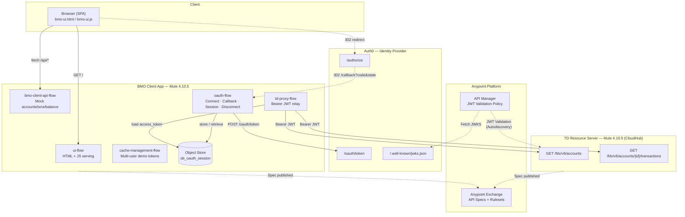
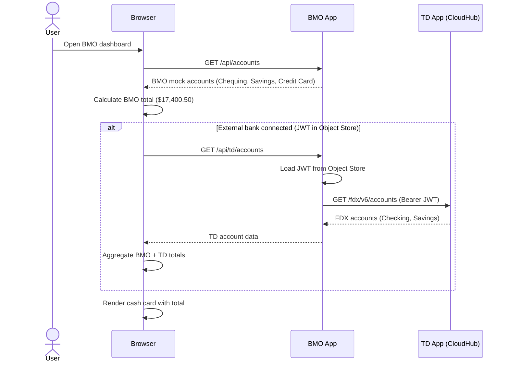
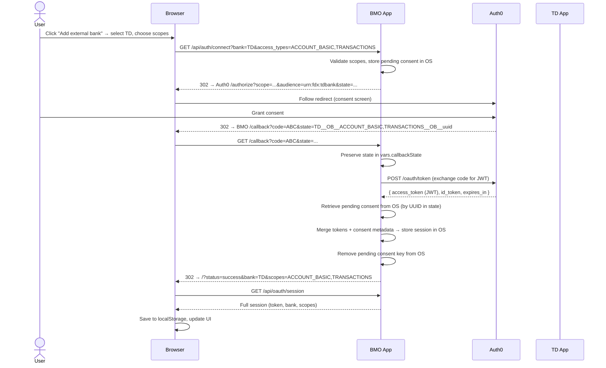
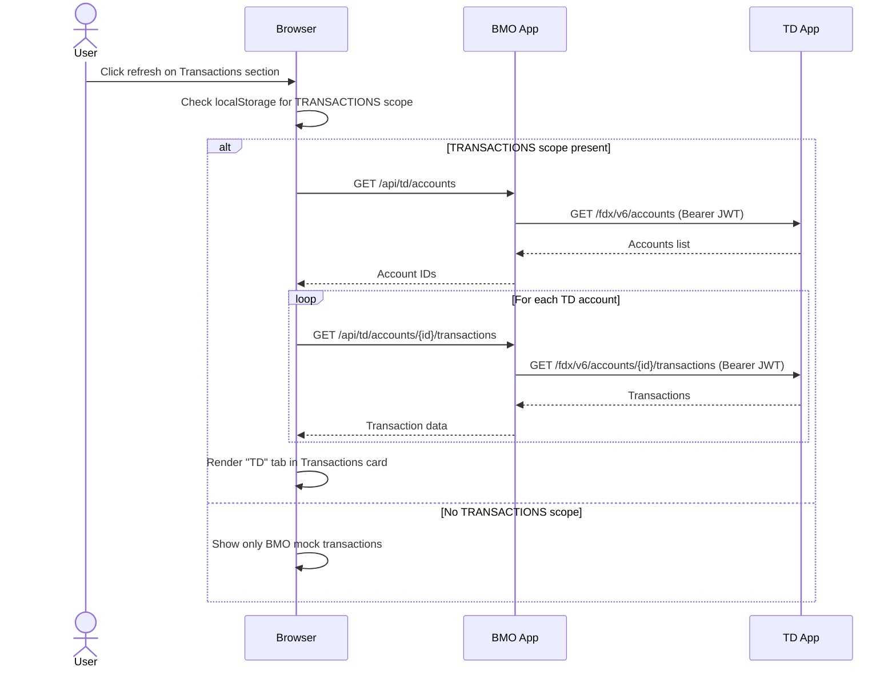
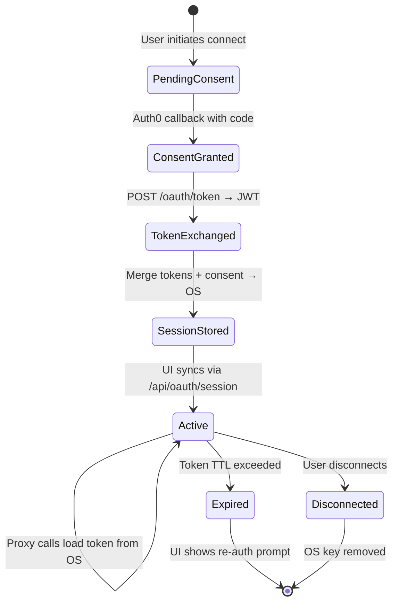
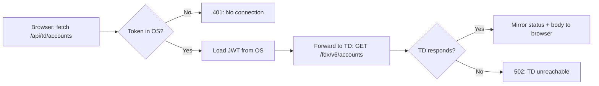
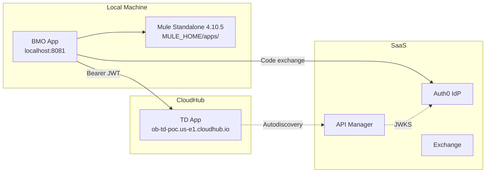

# BMO Open Banking — Technical Specification

> **Version:** 1.0.0  
> **Date:** 2026-03-31  
> **Status:** Proof of Concept  
> **Authors:** Open Banking PoC Team

---

## Table of Contents

1. [Architecture Overview](#1-architecture-overview)
2. [Use Cases](#2-use-cases)
3. [Technology Stack](#3-technology-stack)
4. [System Components](#4-system-components)
5. [Data Flow Diagrams](#5-data-flow-diagrams)
6. [Security Model](#6-security-model)
7. [API Surface](#7-api-surface)
8. [Deployment Architecture](#8-deployment-architecture)

---

## 1. Architecture Overview

The BMO Open Banking PoC demonstrates a **consumer-directed finance** (CDF) pattern
where a primary financial institution (BMO) aggregates account and transaction data
from an external data holder (TD Canada Trust) using the
**FDX (Financial Data Exchange) API v6** standard, with **OAuth 2.0** consent brokered
through **Auth0** as the identity provider.

### 1.1 System Context Diagram



### 1.2 Key Design Decisions

| Decision | Choice | Rationale |
|----------|--------|-----------|
| Runtime | Mule 4 Enterprise 4.10.5 | Anypoint ecosystem, CloudHub deployment, API Manager integration |
| IdP | Auth0 (SaaS) | Fast PoC setup, OIDC + custom scopes, JWKS endpoint for gateway validation |
| API Standard | FDX Core API v6 | Canadian Open Banking alignment, standardised account/transaction semantics |
| Token Storage | Mule Object Store | Server-side JWT persistence, no tokens exposed to browser |
| Client UI | Vanilla HTML/CSS/JS (ES5) | Zero build tooling, embedded in Mule classpath, no framework dependencies |

---

## 2. Use Cases

### UC-1: View Aggregated Cash Balances



**Preconditions:** User has opened the BMO dashboard.  
**Postconditions:** Cash card displays aggregated balance. If an external connection exists with `ACCOUNT_BASIC` scope, TD balances are included.

### UC-2: Link External Bank (OAuth Consent)



### UC-3: View External Transactions



### UC-4: Advisor Consent Notification

The advisor notification flow presents a pre-populated consent request to the user.
When the user clicks the notification bell, a modal appears showing that their advisor
has requested TD bank access with `ACCOUNT_BASIC` and `TRANSACTIONS` scopes. Accepting
initiates the same OAuth flow as UC-2 with pre-selected parameters.

### UC-5: Disconnect External Bank

The user can remove an external connection. The client immediately clears local state
(localStorage, UI arrays) for instant feedback, then asynchronously calls
`POST /api/oauth/disconnect` to remove the session from the Object Store.

---

## 3. Technology Stack

| Layer | Technology | Version | Purpose |
|-------|-----------|---------|---------|
| Runtime | Mule 4 Enterprise | 4.10.5 | Integration runtime |
| Build | Maven | 3.x | Dependency management, packaging |
| Deployment | CloudHub / Local standalone | — | TD on CloudHub, BMO local for dev |
| Identity Provider | Auth0 | SaaS | OAuth 2.0 Authorization Code + OIDC |
| API Standard | FDX Core API | v6.5 | Account + Transaction data model |
| API Spec | OpenAPI | 3.0.3 | Contract-first design |
| API Gateway | Anypoint API Manager | — | JWT Validation policy via Autodiscovery |
| API Registry | Anypoint Exchange | v3 | API spec + ruleset publishing |
| API Governance | AMF Validation Profile | 1.0 | Custom governance rulesets |
| Persistence | Mule Object Store | — | OAuth session + pending consent storage |
| Frontend | Vanilla HTML/CSS/JS | ES5 | Single-page dashboard UI |
| Connectors | HTTP Connector, OS Connector | 1.9.0, 1.2.5 | HTTP requests, persistent KV store |

---

## 4. System Components

### 4.1 BMO Client App (`ob_client_bmo`)

| Mule Config File | Flows | Responsibility |
|-----------------|-------|----------------|
| `global.xml` | HTTP Listener (8081), HTTP Requester, Object Store definition | Shared infrastructure |
| `ui-flow.xml` | `ui-main-flow`, `serve-bmo-ui-js-flow` | Serve SPA (HTML + JS) |
| `ui-flow.xml` | `bmo-client-api-flow`, `get-accounts-flow`, `get-transactions-flow`, `get-balance-flow` | BMO mock data APIs |
| `oauth-flow.xml` | `oauth-connect-flow` | Initiate consent: validate params, store pending consent, redirect to Auth0 |
| `oauth-flow.xml` | `oauth-callback-flow` | Handle Auth0 callback: exchange code, merge consent metadata, persist session |
| `oauth-flow.xml` | `oauth-session-http-flow`, `oauth-disconnect-http-flow` | Session retrieval and teardown |
| `td-proxy-flow.xml` | `td-proxy-accounts-flow`, `td-proxy-transactions-flow` | Bearer token relay to TD resource server |
| `cache-management-flow.xml` | `clear-cache-flow`, `store-token-with-scopes-flow`, `get-user-data-flow`, `list-connected-users-flow` | Demo multi-user token management |

### 4.2 TD Resource Server (`ob_td_app`)

| Flow | Path | Scope Required | Description |
|------|------|----------------|-------------|
| `get-accounts-flow` | `GET /fdx/v6/accounts` | `ACCOUNT_BASIC` | Returns mock deposit accounts |
| `get-account-flow` | `GET /fdx/v6/accounts/{accountId}` | `ACCOUNT_BASIC` | Returns single account detail |
| `get-transactions-flow` | `GET /fdx/v6/accounts/{accountId}/transactions` | `TRANSACTIONS` | Returns mock transactions with pagination |

The TD app enforces scope checks in-app via DataWeave. The JWT Validation policy on API Manager validates the token signature using Auth0's JWKS endpoint before the request reaches the app.

### 4.3 Object Store Keys

| Key Pattern | Stored By | Retrieved By | Content |
|-------------|-----------|--------------|---------|
| `ob_oauth_session` | `oauth-callback-flow` | `oauth-session-api-subflow`, `load-td-access-token-subflow` | Full session: JWT, bank metadata, scopes, timestamps |
| `ob_oauth_pending__{uuid}` | `oauth-connect-flow` | `oauth-callback-flow` | Pre-Auth0 consent: bank name, brand, scopes, display name |

---

## 5. Data Flow Diagrams

### 5.1 OAuth Token Lifecycle



### 5.2 BMO Proxy Request Flow



### 5.3 State Parameter Encoding

The OAuth `state` parameter encodes consent metadata as a composite string:

```
{bank}__OB__{scopes_csv}__OB__{uuid}
```

Example: `TD__OB__ACCOUNT_BASIC,TRANSACTIONS__OB__a1b2c3d4-e5f6-...`

- **{bank}**: Bank identifier (fallback if pending OS record is missing)
- **{scopes_csv}**: Requested FDX scopes (fallback)
- **{uuid}**: Unique key for the pending consent record in OS

The `state` is preserved in `vars.callbackState` before the HTTP token exchange
(which overwrites `attributes`), then used to retrieve and clean up the pending
consent record.

---

## 6. Security Model

### 6.1 OAuth 2.0 Authorization Code Flow

| Parameter | Value |
|-----------|-------|
| Grant Type | `authorization_code` |
| IdP | Auth0 (`dev-77sisti8b11ec8tp.us.auth0.com`) |
| Client ID | `ywXBlXbbDmE8K2VkuXKy36YjjHlo7iTv` |
| Audience | `urn:fdx:tdbank` |
| Scopes (OIDC) | `openid`, `profile`, `email` |
| Scopes (FDX) | `ACCOUNT_BASIC`, `TRANSACTIONS`, `CUSTOMER_CONTACT` |
| Redirect URI | `http://localhost:8081/callback` |
| Prompt | `consent` (always show consent screen) |

### 6.2 JWT Structure

```
Header:  { alg: RS256, typ: JWT, kid: ... }
Payload: {
  iss: "https://dev-77sisti8b11ec8tp.us.auth0.com/",
  sub: "auth0|...",
  aud: ["urn:fdx:tdbank", "https://dev-77sisti8b11ec8tp.us.auth0.com/userinfo"],
  scope: "openid profile email ACCOUNT_BASIC TRANSACTIONS",
  azp: "ywXBlXbbDmE8K2VkuXKy36YjjHlo7iTv",
  iat: ..., exp: ...
}
Signature: RS256 (validated via JWKS)
```

### 6.3 Token Flow Security

| Concern | Mitigation |
|---------|-----------|
| Token exposure | JWT stored server-side in Object Store; never sent to browser |
| CSRF | `state` parameter with UUID bound to pending consent |
| Token validation | API Manager JWT Validation policy checks signature via JWKS |
| Scope enforcement | TD app validates FDX scopes in DataWeave; returns 403 if missing |
| Bank identity | Derived from JWT `aud` claim (e.g., `urn:fdx:tdbank` → "TD") on both server and client |
| Session cleanup | Pending consent removed after callback; disconnect removes session |

### 6.4 API Manager Policy Configuration

The TD resource server has a **JWT Validation** policy applied via **Autodiscovery**:

- **JWKS URL:** `https://dev-77sisti8b11ec8tp.us.auth0.com/.well-known/jwks.json`
- **Expected Audience:** `urn:fdx:tdbank`
- **Expected Issuer:** `https://dev-77sisti8b11ec8tp.us.auth0.com/`
- **Claim Mapping:** `vars.claimSet` populated with decoded JWT claims

---

## 7. API Surface

### 7.1 BMO Client API

| Method | Path | Auth | Description |
|--------|------|------|-------------|
| `GET` | `/` | None | Serve SPA HTML |
| `GET` | `/web/bmo-ui.js` | None | Serve UI JavaScript |
| `GET` | `/api/accounts` | None | BMO mock accounts |
| `GET` | `/api/transactions` | None | BMO mock transactions |
| `GET` | `/api/balance` | None | Aggregated balance with OAuth context |
| `GET` | `/api/td/accounts` | OAuth Session | Proxy to TD `/fdx/v6/accounts` |
| `GET` | `/api/td/accounts/{id}/transactions` | OAuth Session | Proxy to TD `/fdx/v6/accounts/{id}/transactions` |
| `GET` | `/api/auth/connect` | None | Initiate OAuth consent flow |
| `GET` | `/callback` | None | OAuth callback (Auth0 redirect target) |
| `GET` | `/api/oauth/session` | None | Retrieve current session |
| `POST` | `/api/oauth/disconnect` | None | Remove OAuth session |
| `POST` | `/api/clear-cache` | None | Clear all caches |
| `POST` | `/api/store-token` | None | Store per-user token |
| `GET` | `/api/user-data` | None | Get cached user data |
| `GET` | `/api/connected-users` | None | List connected users |

### 7.2 TD Resource Server API (FDX)

| Method | Path | Scope | Description |
|--------|------|-------|-------------|
| `GET` | `/fdx/v6/accounts` | `ACCOUNT_BASIC` | Search for accounts |
| `GET` | `/fdx/v6/accounts/{accountId}` | `ACCOUNT_BASIC` | Get account detail |
| `GET` | `/fdx/v6/accounts/{accountId}/transactions` | `TRANSACTIONS` | Search for account transactions |

All TD endpoints require a valid Bearer JWT with `aud: urn:fdx:tdbank`. The JWT
Validation policy on API Manager validates the token before it reaches the Mule app.

---

## 8. Deployment Architecture

### 8.1 Local Development



### 8.2 Build & Deploy

```bash
# BMO Client — build and deploy to local Mule standalone
cd ob_client_bmo
mvn clean package -DskipTests
cp target/ob_client_bmo-1.0.0-SNAPSHOT-mule-application.jar \
   $MULE_HOME/apps/

# TD App — deployed on CloudHub via Runtime Manager
# or built locally:
cd ob_td_app
mvn clean package -DskipTests
```

### 8.3 Configuration

Key properties in `src/main/resources/local.yaml`:

| Property | Description |
|----------|-------------|
| `oauth.auth0.domain` | Auth0 tenant domain |
| `oauth.auth0.authorize_endpoint` | Auth0 authorization URL |
| `oauth.auth0.token_endpoint` | Auth0 token exchange URL |
| `oauth.auth0.client_id` | Auth0 application client ID |
| `oauth.auth0.client_secret` | Auth0 client secret (secured) |
| `oauth.auth0.audience` | JWT audience (`urn:fdx:tdbank`) |
| `oauth.auth0.redirect_uri` | OAuth callback URL |
| `td.resource_server.base_url` | TD app base URL (CloudHub or local) |

---

*End of Technical Specification*
